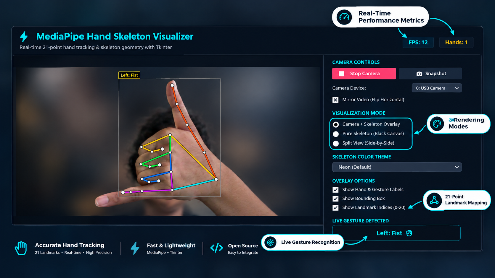
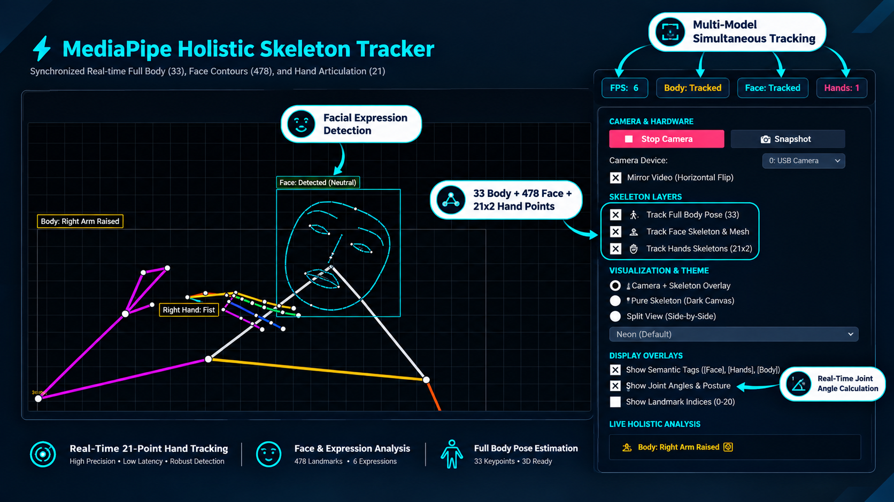

<div align="center">

# ✋ MediaPipe Skeleton Tracking Suite
### Real-Time Hand & Holistic (Body + Face + Hands) Motion Tracking


<p align="center">
  <b>Two real-time computer vision desktop apps built with MediaPipe, OpenCV, and Tkinter —</b><br>
  one for detailed hand-gesture skeleton tracking, and one for full holistic (body + face + hands) tracking with posture and expression analysis.
</p>

</div>

---

## 📸 Preview

### Hand Skeleton Visualizer


### Holistic Skeleton Tracker


---

## ✨ Features

### 🖐️ Hand Skeleton Tracking (`hand.py`)
- Real-time 21-point hand landmark detection (per hand)
- Smooth, colored skeleton connections and joint rendering
- Supports both legacy MediaPipe Solutions and the modern MediaPipe Tasks API
- 3 view modes: Camera Overlay, Pure Skeleton (Canvas), Split View (side-by-side)
- 4 color themes: Finger-Coded, Neon Cyberpunk, Matrix, Classic White
- Real-time gesture recognition (Open Palm, Fist, Peace, Thumbs Up, Pointing, etc.)
- Snapshot capture to save frames with the skeleton overlay
- Offline/demo simulation mode when no webcam is available

### 🧍 Holistic Skeleton Tracking (`body.py`)
- **Full body:** 33-point pose estimation with joint-angle calculation (elbows, knees) and posture classification
- **Face:** facial contour mesh (eyes, eyebrows, lips, nose, oval), expression analysis, semantic "Face: Detected" labeling
- **Hands:** 21 articulated joints per hand (left & right), finger-coded bone segments, live gesture classification
- Simultaneous multi-model inference (Pose + Face + Hands together) via the MediaPipe Tasks API, with graceful fallbacks
- Individual on/off toggles per tracking layer (Body / Face / Hands)
- Same 3 view modes and 4 color themes as the hand tracker
- Live metrics dashboard (FPS, tracked-entity status), snapshot capture, and a synthetic mannequin demo mode

---

## 🛠️ Tech Stack
Python 3.10+, MediaPipe (Tasks API), OpenCV, Tkinter (GUI), Pillow, NumPy

---

## 📂 Project Structure
```
ComputerVision/
├── hand.py                    # Hand skeleton tracking app
├── body.py                    # Holistic (body+face+hands) tracking app
├── requirements.txt
├── face_landmarker.task       # MediaPipe face model
├── hand_landmarker.task       # MediaPipe hand model
├── pose_landmarker_lite.task  # MediaPipe pose model
└── assets/                    # Preview images
```

## ⚡ Quickstart

```bash
git clone https://github.com/nayab-gull-it/ComputerVision.git
cd ComputerVision

python -m venv .venv
.venv\Scripts\activate        # Windows
# source .venv/bin/activate   # macOS/Linux

pip install -r requirements.txt
```

Run the hand tracker:
```bash
python hand.py
```

Run the holistic tracker:
```bash
python body.py
```

> **Note:** A working webcam is required for live tracking; both apps fall back to a demo/simulation mode if no camera is detected.

---

**Author:** Nayab Gull